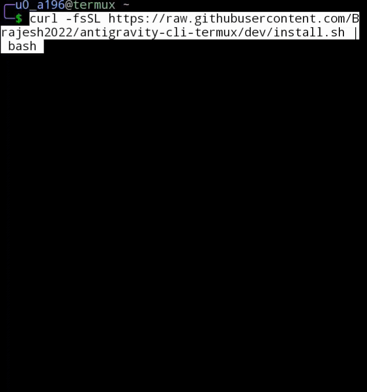
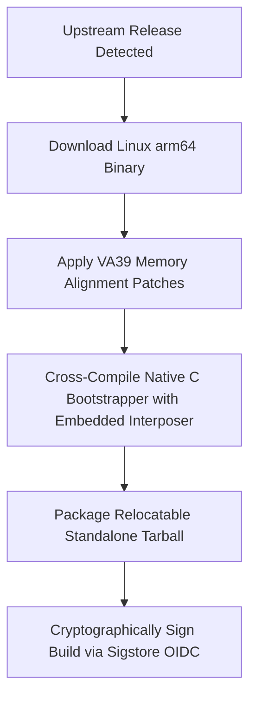

# Antigravity CLI
> [!NOTE]
> **Community Acknowledgement:** Much of the core binary patching and VA39 memory layout engineering implemented in this Termux fork is built upon the foundational work and discoveries of [@hjotha](https://github.com/hjotha) and [@Brajesh2022](https://github.com/Brajesh2022). Deep appreciation to the community for unlocking compatibility!

## 🚀 Quick Start (Termux)

```bash
curl -fsSL https://raw.githubusercontent.com/wallentx/antigravity-cli-termux/dev/install.sh | bash
```



## 📱 Termux Standalone Port & Architecture

This repository maintains an automated standalone fork of the Google Antigravity TUI CLI that is fully relocatable, wrapper-less, and self-updating within the Android Termux `arm64` environment.

### 🛠️ Automated Artifact Generation Pipeline

Every 6 hours, a GitHub Actions workflow performs the following engineering pipeline to produce the release archive:



#### 1. VA39 Memory Layout Patching (TCMalloc)
Upstream utilizes Google's `TCMalloc`, which assumes a standard 48-bit Virtual Address (VA) space. On Android devices with custom kernels or older configurations, the user space is restricted to a 39-bit VA space. Running the unmodified binary results in segmentation faults or fatal allocation failures (`MmapAligned() failed`).
A dedicated Python patching process is executed during the build to:
* Rewrite specific bitmask and `ubfx` (unsigned bitfield extract) instructions.
* Adjust page-alignment logic and `mmap` parameters.
* Rewrite low-level library wrappers (`faccessat2`) to guarantee absolute compatibility with 39-bit systems.

#### 2. Relocatable C Bootstrapper
Standard Termux runs under the Android Bionic libc environment, injecting specific preloads (`LD_PRELOAD=/data/.../libtermux-exec.so`) to intercept calls. However, because the patched binary is built under glibc, loading it directly causes immediate crashes (`invalid ELF header`) when the glibc dynamic linker processes Bionic preloads.
To circumvent this, a relocatable C bootstrapper (`bin/agy`) is compiled:
* **Dynamic Resolution**: Resolves its own folder at runtime using `/proc/self/exe` via `readlink`, enabling the package to be extracted and executed in *any* directory without wrapper scripts.
* **Environment Cleansing**: Unsets conflicting environment variables (`LD_PRELOAD`, `LD_LIBRARY_PATH`) before executing the loader.
* **Redirection**: Configures the native Termux CA bundle (`SSL_CERT_FILE`) and DNS routing (`GODEBUG=netdns=cgo`), then passes execution cleanly to the glibc loader.

#### 3. PRoot Distro Compatibility (Dynamic Interposer)
When running inside a non-native Termux environment (e.g., a guest PRoot environment on Android), memory allocation limits can trigger immediate TCMalloc crashes due to the 39-bit VA kernel boundaries.
To resolve this, a runtime **Memory Interposer** architecture is implemented:
* **Embedded Interposer**: A dynamic shared library (`libmmap_va39_fix.so`) intercepts `mmap` calls at runtime and redirects memory allocation requests above the 39-bit limit to safe address ranges.
* **Just-in-Time Unpacking**: To keep the standalone release footprint restricted strictly to the `bin/` directory, the interposer library is embedded as a raw byte array directly inside the `bin/agy` executable. At runtime, the bootstrapper automatically extracts the `.so` to a writable temp directory (`$TMPDIR` -> `/tmp`) and preloads it on the fly.
* *For more details, see the technical reference at [docs/PROOT_DISTRO_COMPAT.md](docs/PROOT_DISTRO_COMPAT.md).*

#### 4. In-Place Self-Updating
The C bootstrapper intercepts the `update` subcommand and queries this fork's GitHub Releases API, providing a seamless in-place update mechanism that updates both the patched engine and itself without needing complex wrappers or manually executing curl commands.

---

Antigravity CLI understands your codebase, makes edits with your permission, and executes commands — right from your terminal.

- **Official Docs**: [antigravity.google/docs/cli-overview](https://antigravity.google/docs/cli-overview)
- **Official Website**: [antigravity.google/product/antigravity-cli](https://antigravity.google/product/antigravity-cli)


---

Antigravity CLI brings the core capabilities of Antigravity 2.0 (multi-step reasoning, multi-file editing, tool calling, and persistent history) directly to your terminal. It is optimized for keyboard-driven workflows and remote SSH sessions with minimal resource overhead.

---

## Features at a Glance

| Feature | Antigravity CLI | Antigravity 2.0 |
| :--- | :--- | :--- |
| **Primary Focus** | Speed, keyboard efficiency, low overhead | Comprehensiveness, visual orchestration, project management |
| **Interface** | Terminal User Interface (TUI) | Full Rich GUI Application |
| **Workflows** | SSH/Remote sessions, keyboard-first | Local workspaces, heavy orchestration |
| **Agent Engine** | Shared Core Agent Engine | Shared Core Agent Engine |

---

## Integration

- **Shared Agent Engine**: Both interfaces run on the same core agent engine. Improvements automatically apply to both.
- **Shared Settings**: Preferences and permissions sync bidirectionally.
- **Session Export**: Export terminal sessions to the Antigravity 2.0 GUI to continue working.

---

## Installation

### Android (Termux)
```bash
curl -fsSL https://raw.githubusercontent.com/wallentx/antigravity-cli-termux/dev/install.sh | bash
```

### macOS / Linux
```bash
curl -fsSL https://antigravity.google/cli/install.sh | bash
```

### Windows PowerShell
```powershell
irm https://antigravity.google/cli/install.ps1 | iex
```

### Windows CMD
```cmd
curl -fsSL https://antigravity.google/cli/install.cmd -o install.cmd && install.cmd && del install.cmd
```

---

## Authentication

The CLI authenticates via the system keyring, falling back to Google Sign-In if no active session exists.

- **Local**: Automatically opens your default browser.
- **Remote / SSH**: Detects SSH sessions and prints an authorization URL to complete login locally.
- **Sign Out**: Run `/logout` to clear saved credentials.

> [!NOTE]
> For enterprise access, connect your GCP project during onboarding. See the Enterprise page for details.

---

## Terms of Service & Data Use

> [!WARNING]
> AI coding agents are known to have certain security risks, including autonomous code execution, data exfiltration, prompt injection, and supply chain risks. Ensure that you monitor and verify all actions taken by the agent.

By using Antigravity CLI, you agree to help improve the product by allowing Google to collect and use your Interactions data, subject to the Google Terms of Service and Google Privacy Policy. You can choose to opt out at any time via your settings.

### Legal & Privacy Links

- **Terms of Service**: [antigravity.google/terms](https://antigravity.google/terms)
- **Privacy Policy**: [policies.google.com/privacy](https://policies.google.com/privacy)
