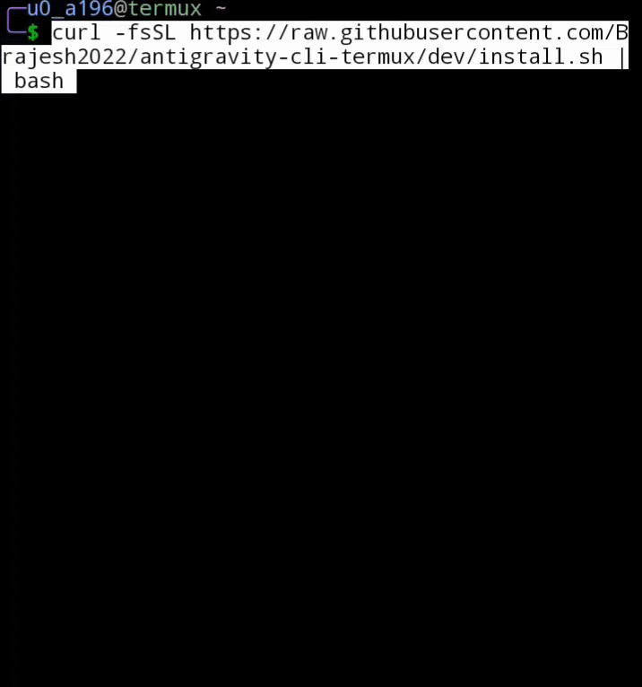
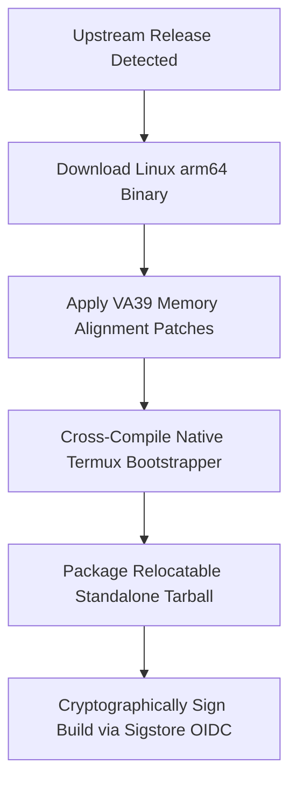

# Antigravity CLI
> [!NOTE]
> **Community Acknowledgement:** Much of the core binary patching and VA39 memory layout engineering implemented in this Termux fork is built upon the foundational work and discoveries of [@hjotha](https://github.com/hjotha) and [@Brajesh2022](https://github.com/Brajesh2022). Deep appreciation to the community for unlocking compatibility!

## 🚀 Quick Start (Termux)

```bash
curl -fsSL https://raw.githubusercontent.com/wallentx/antigravity-cli-termux/dev/install.sh | bash
```



## 📱 Termux Standalone Port & Architecture

This repository maintains an automated standalone fork of the Google Antigravity TUI CLI that is fully relocatable, wrapper-less, and self-updating within the Android Termux `arm64` environment.

### 🛠️ Automated Artifact Generation Pipeline

Every 6 hours, a GitHub Actions workflow performs the following engineering pipeline to produce the release archive:


```mermaid
graph TD
    A[Upstream Release Detected] --> B[Download Linux arm64 Binary]
    B --> C[Apply VA39 Memory Alignment Patches]
    C --> D[Cross-Compile Native Termux Bootstrapper]
    D --> E[Package Relocatable Standalone Tarball]
    E --> F[Cryptographically Sign Build via Sigstore OIDC]
```

#### 1. VA39 Memory Layout Patching (TCMalloc)
Upstream utilizes Google's `TCMalloc`, which assumes a standard 48-bit Virtual Address (VA) space. On Android devices with custom kernels or older configurations, the user space is restricted to a 39-bit VA space. Running the unmodified binary results in segmentation faults or fatal allocation failures (`MmapAligned() failed`).
A dedicated Python patching process is executed during the build to:
* Rewrite specific bitmask and `ubfx` (unsigned bitfield extract) instructions.
* Adjust page-alignment logic and `mmap` parameters.
* Rewrite low-level library wrappers (`faccessat2`) to guarantee absolute compatibility with 39-bit systems.

#### 2. Relocatable C Bootstrapper
Standard Termux runs under the Android Bionic libc environment, injecting specific preloads (`LD_PRELOAD=/data/.../libtermux-exec.so`) to intercept calls. However, because the patched binary is built under glibc, loading it directly causes immediate crashes (`invalid ELF header`) when the glibc dynamic linker processes Bionic preloads.
To circumvent this, a relocatable C bootstrapper (`agy`) is compiled:
* **Dynamic Resolution**: Resolves its own folder at runtime using `/proc/self/exe` via `readlink`, enabling the package to be extracted and executed in *any* directory without wrapper scripts.
* **Runtime Selection**: On LSE-capable CPUs, uses the executable `$PREFIX/bin/aether-run` entry point when installed by Termux Aether. This uses Aether's APK-installed loader instead of routing the package-managed glibc loader through Android's linker, which can abort with `Could not find a PHDR`. Otherwise, keeps the existing glibc/QEMU path.
* **Environment Cleansing**: Unsets conflicting environment variables (`LD_PRELOAD`, `LD_LIBRARY_PATH`) on the traditional loader path. Preserves them for Aether's Bionic wrapper, which handles the glibc transition and mixed Linux/Android child processes itself.
* **Redirection**: Configures the native Termux CA bundle (`SSL_CERT_FILE`) and DNS routing (`GODEBUG=netdns=cgo`), then forwards arguments to the selected runtime and sibling `agy.va39` payload.

Aether detection uses the installed absolute entry point, not a version string or a command found on `PATH`. Set `AGY_NO_AETHER=1` to force the traditional loader; the installer honors the same opt-out. Aether startup errors are returned without retrying the payload through another runtime. Resolver requirements, update interception, and startup update checks still apply. The installer accepts Aether's runtime instead of requiring the package-managed loader for native execution; optional Linux dependencies may still require packages under `$PREFIX/glibc`.

#### 3. LSE (Large System Extensions) & QEMU Support
The engine requires ARMv8.1-A Atomics (LSE) to run natively. On older ARMv8.0-A CPUs lacking LSE support, the binary will crash with an "Illegal Instruction".
This fork includes an automated compatibility layer:
* **Detection**: The installer and bootstrapper automatically detect if the CPU lacks LSE support via `getauxval(AT_HWCAP)`.
* **QEMU Emulation**: If LSE is missing and `qemu-aarch64` is already installed, the bootstrapper wraps engine execution through it. If QEMU is missing, the installer reports that the `qemu-user-aarch64` package may be needed and exits without installing packages automatically.

#### 4. Native Termux Only
This standalone port is intentionally scoped to native Termux on Android. PRoot environments can run Google's official Antigravity CLI binary directly, so this project no longer ships a PRoot compatibility layer.

If you are inside PRoot, use the official installer instead:

```bash
curl -fsSL https://antigravity.google/cli/install.sh | bash
```

#### 5. In-Place Self-Updating
The C bootstrapper intercepts the `update` subcommand and provides a seamless in-place update mechanism that updates both the patched engine and itself without needing complex wrappers or manually executing curl commands.

Interactive launches also perform a silent, five-second-bounded release check. Nothing is printed when the installed release is current, newer than the published release, or GitHub cannot be reached. Only a strictly newer semantic version triggers the same install prompt as `agy update`.

Before replacement, the updater stages and validates both binaries, then backs up the installed pair. Any failed replacement restores both originals. Startup continues whether the check or installation succeeds or fails. Set `AGY_UPDATE_DEBUG=1` to print suppressed startup-check errors to stderr.

---

Antigravity CLI understands your codebase, makes edits with your permission, and executes commands — right from your terminal.

- **Official Docs**: [antigravity.google/docs/cli/overview](https://antigravity.google/docs/cli/overview)
- **Official Website**: [antigravity.google/product/antigravity-cli](https://antigravity.google/product/antigravity-cli)


---

Antigravity CLI brings the core capabilities of Antigravity 2.0 (multi-step reasoning, multi-file editing, tool calling, and persistent history) directly to your terminal. It is optimized for keyboard-driven workflows and remote SSH sessions with minimal resource overhead.

---

## Features at a Glance

| Feature | Antigravity CLI | Antigravity 2.0 |
| :--- | :--- | :--- |
| **Primary Focus** | Speed, keyboard efficiency, low overhead | Comprehensiveness, visual orchestration, project management |
| **Interface** | Terminal User Interface (TUI) | Full Rich GUI Application |
| **Workflows** | SSH/Remote sessions, keyboard-first | Local workspaces, heavy orchestration |
| **Agent Engine** | Shared Core Agent Engine | Shared Core Agent Engine |

---

## Integration

- **Shared Agent Engine**: Both interfaces run on the same core agent engine. Improvements automatically apply to both.
- **Shared Settings**: Preferences and permissions sync bidirectionally.
- **Session Export**: Export terminal sessions to the Antigravity 2.0 GUI to continue working.

---

## Installation

### Android (Termux)
```bash
curl -fsSL https://raw.githubusercontent.com/wallentx/antigravity-cli-termux/dev/install.sh | bash
```

### macOS / Linux
```bash
curl -fsSL https://antigravity.google/cli/install.sh | bash
```

### Windows PowerShell
```powershell
irm https://antigravity.google/cli/install.ps1 | iex
```

### Windows CMD
```cmd
curl -fsSL https://antigravity.google/cli/install.cmd -o install.cmd && install.cmd && del install.cmd
```

## Usage

After installation, start Antigravity CLI by running:

```bash
agy
```

---

## Authentication

The CLI authenticates via the system keyring, falling back to Google Sign-In if no active session exists.

- **Local**: Automatically opens your default browser.
- **Remote / SSH**: Detects SSH sessions and prints an authorization URL to complete login locally.
- **Sign Out**: Run `/logout` to clear saved credentials.

> [!NOTE]
> For enterprise access, connect your GCP project during onboarding. See the Enterprise page for details.

---

## Terms of Service & Data Use

> [!WARNING]
> AI coding agents are known to have certain security risks, including autonomous code execution, data exfiltration, prompt injection, and supply chain risks. Ensure that you monitor and verify all actions taken by the agent.

By using Antigravity CLI, you agree to help improve the product by allowing Google to collect and use your Interactions data, subject to the Google Terms of Service and Google Privacy Policy. You can choose to opt out at any time via your settings.

### Legal & Privacy Links

- **Terms of Service**: [antigravity.google/terms](https://antigravity.google/terms)
- **Privacy Policy**: [policies.google.com/privacy](https://policies.google.com/privacy)
